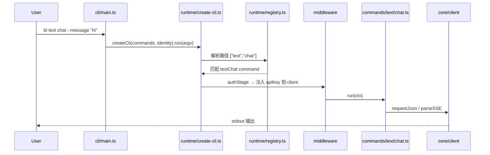

# bailian-cli 快速上手指南

> 本文档面向新加入项目的开发者，帮助你理解 monorepo 的整体架构、代码组织方式和日常开发流程。  
> AI Agent 维护契约见根目录 [`AGENTS.md`](../AGENTS.md)；各场景的详细清单见 [`docs/agents/`](agents/)。

---

## 1. 项目是什么

**bailian-cli** 是阿里云百炼（DashScope / Model Studio）平台的命令行工具，让用户和 AI Agent 通过终端调用平台的全部 AI 能力：

- 文本/全模态对话、图像/视频生成与编辑、语音合成与识别
- 知识库检索、记忆管理、应用调用、MCP 集成
- 微调与部署、数据集管理、配额与业务空间
- 控制台能力（用量统计、限流提额、资产中心等）

仓库以 **pnpm monorepo** 组织，产出两个 npm 产品：

| 产品           | 包名                   | 二进制           | 定位                                 |
| -------------- | ---------------------- | ---------------- | ------------------------------------ |
| 百炼全量 CLI   | `bailian-cli`          | `bl` / `bailian` | 暴露全部命令                         |
| 知识库轻量 CLI | `knowledge-studio-cli` | `kscli`          | 仅 config + knowledge 命令，路径拍平 |

---

## 2. 技术栈

| 类别      | 选型                                                                                         |
| --------- | -------------------------------------------------------------------------------------------- |
| 语言      | TypeScript（strict）                                                                         |
| 运行时    | Node.js ≥ 22.12                                                                              |
| 包管理    | pnpm 10 + workspace catalog                                                                  |
| 构建/测试 | [vite-plus](https://github.com/voidzero-dev/vite-plus)（`vp check` / `vp test` / `vp pack`） |
| HTTP      | undici（经 core client 封装）                                                                |
| 模块      | ESM（`"type": "module"`）                                                                    |

---

## 3. 核心架构：四层分层

项目按 **「纯逻辑 → 运行时框架 → 命令库 → 产品入口」** 严格分层，职责边界清晰：

```
┌─────────────────────────────────────────────────────────────────┐
│  产品入口层                                                       │
│  packages/cli (bl)    packages/kscli (kscli)                    │
│  决定命令路径 map、产品 identity、README、技能 reference           │
└────────────────────────────┬────────────────────────────────────┘
                             │ createCli(commands, identity)
┌────────────────────────────▼────────────────────────────────────┐
│  运行时框架层  packages/runtime (bailian-cli-runtime)            │
│  参数解析、命令树/registry、help、middleware、错误处理、输出       │
└────────────────────────────┬────────────────────────────────────┘
                             │ 调用 defineCommand 的 run()
┌────────────────────────────▼────────────────────────────────────┐
│  命令库层  packages/commands (bailian-cli-commands)              │
│  96+ 命令实现；只导出 command，不决定产品路径                       │
└────────────────────────────┬────────────────────────────────────┘
                             │ client / settings / auth
┌────────────────────────────▼────────────────────────────────────┐
│  纯逻辑层  packages/core (bailian-cli-core)                       │
│  鉴权、配置、HTTP client、错误、类型、文件工具、领域 API            │
└─────────────────────────────────────────────────────────────────┘
```

### 分层边界（必须遵守）

| 层              | 可以做                      | 不能做                                                        |
| --------------- | --------------------------- | ------------------------------------------------------------- |
| **core**        | 纯库逻辑、HTTP、鉴权解析    | 依赖 runtime/commands；硬编码 `bl`/`kscli`；调 `process.exit` |
| **runtime**     | TTY、help、middleware、输出 | 写具体业务命令逻辑                                            |
| **commands**    | 命令元数据 + `run` 实现     | 决定产品路径；在 usage 里写 bin 前缀                          |
| **cli / kscli** | 命令路径 map、产品 identity | 不写命令业务逻辑                                              |

---

## 4. 包详解

### 4.1 `packages/core` — `bailian-cli-core`

纯逻辑层，被所有上层依赖。主要模块：

```
packages/core/src/
├── auth/           # API Key / Console token 解析与落盘
├── client/         # HTTP client、endpoints、MCP、流式解析
├── config/         # ~/.bailian/config.json、Settings、来源优先级
├── console/        # Console Gateway 调用
├── dataset/        # 数据集校验（ChatML/DPO/CPT schema）
├── finetune/       # 微调 API 与能力探测
├── deploy/         # 部署 API
├── advisor/        # 模型推荐（意图识别 + 召回）
├── errors/         # BailianError、UsageError、退出码
├── output/         # JSON/text 格式化（命令层也可用 runtime 的 emit）
├── files/          # 本地文件上传、URL 解析
├── telemetry/      # 命令执行遥测
└── types/          # Command、FlagsDef、defineCommand
```

**关键类型** — 每个命令通过 `defineCommand` 声明：

```typescript
defineCommand({
  description: "…",
  auth: "apiKey" | "console" | "none",
  flags: {
    /* camelCase key → kebab-case CLI flag */
  },
  usageArgs: "--prompt <text> [flags]", // 不含 bl/kscli 前缀
  exampleArgs: ['--prompt "hello"'],
  validate: (flags) => string | undefined, // 跨 flag 校验
  run: async (ctx) => {
    /* ctx.client / ctx.flags / ctx.settings */
  },
});
```

**Client** 是命令的网络入口，凭证已注入，命令层不碰 token：

```typescript
ctx.client.requestJson({ path: "/…", method: "POST", body });
ctx.client.console({ product: "…", action: "…", params });
ctx.client.uploadFile(localPath);
ctx.client.mcp(…);
```

### 4.2 `packages/runtime` — `bailian-cli-runtime`

通用 CLI 框架，与具体业务无关。核心文件：

| 文件               | 职责                                            |
| ------------------ | ----------------------------------------------- |
| `create-cli.ts`    | 入口工厂：`createCli(commands, identity).run()` |
| `registry.ts`      | 从 `Record<string, AnyCommand>` 建树，动态 help |
| `args.ts`          | 路径 + flag 解析                                |
| `middleware.ts`    | auth → telemetry → versionCheck → runCommand    |
| `error-handler.ts` | 统一错误输出与退出码                            |
| `urls.ts`          | 用户面控制台 URL（非 API endpoint）             |
| `output/`          | 颜色、表格、进度条、banner                      |
| `pipeline/`        | 多步 pipeline 编排（`bl pipeline run`）         |

**Middleware 流水线**（洋葱模型）：

```
argv 解析
  → authStage        按 command.auth 注入 apiKey / console 凭证到 ctx.client
  → telemetryStage   记录命令执行
  → versionCheckStage 检查 npm 更新
  → runCommandStage  调用 command.run(ctx)
```

### 4.3 `packages/commands` — `bailian-cli-commands`

命令实现库，按**能力域**组织目录（≠ 最终 CLI 路径）：

```
packages/commands/src/commands/
├── text/           # 文本对话
├── omni/           # 全模态对话
├── image/          # 图像生成/编辑
├── video/          # 视频生成/编辑/下载
├── speech/         # 语音合成/识别
├── vision/         # 图像/视频理解
├── knowledge/      # 知识库检索/搜索/对话
├── memory/         # 记忆管理
├── app/            # 应用调用
├── mcp/            # MCP 服务
├── auth/           # 登录/登出/状态
├── config/         # 配置读写
├── console/        # 通用 Console Gateway 调用
├── dataset/        # 数据集上传/校验
├── finetune/       # 微调任务
├── deploy/         # 模型部署
├── quota/          # 限流与提额
├── workspace/      # 业务空间
├── usage/          # 用量统计
├── advisor/        # 模型推荐
├── asset-center/   # 资产中心（新）
├── pipeline/       # Pipeline 编排
├── search/         # 联网搜索
├── file/           # 文件上传
├── token-plan/     # Token 计划
└── update.ts       # 自更新
```

每个命令文件 `export default defineCommand(…)`，并在 `packages/commands/src/index.ts` 具名 re-export。

### 4.4 `packages/cli` — `bailian-cli`（`bl`）

产品入口，极薄：

```typescript
// packages/cli/src/main.ts
createCli(commands, {
  binName: "bl",
  version: pkg.version,
  clientName: "bailian-cli",
  npmPackage: "bailian-cli",
}).run();
```

**命令路径由 `packages/cli/src/commands.ts` 决定**，例如：

```typescript
export const commands: Record<string, AnyCommand> = {
  "text chat": textChat,
  "asset-center list": assetList,
  "finetune create": finetuneCreate,
  update, // 单级命令 key 即路径
};
```

此文件还被 `tools/generate-reference.ts` 读取，生成 Agent Skill 参考文档。

### 4.5 `packages/kscli` — `knowledge-studio-cli`（`kscli`）

轻量 RAG 产品，**复用同一套 commands**，但路径拍平：

```typescript
const commands = {
  retrieve: knowledgeRetrieve, // ↔ bl knowledge retrieve
  search: knowledgeSearch, // ↔ bl knowledge search
  chat: knowledgeChat, // ↔ bl knowledge chat
  "config show": configShow,
  update,
};
```

同一个 `knowledgeRetrieve` 实现，在 `bl` 显示 `bl knowledge retrieve`，在 `kscli` 显示 `kscli retrieve`——路径完全由产品入口 map 的 key 决定。

---

## 5. 一次命令执行的完整链路

以 `bl text chat --message "hi"` 为例：



**配置与凭证解析优先级**（core 统一处理，命令不介入）：

| 来源 | API Key                 | Console Token                         |
| ---- | ----------------------- | ------------------------------------- |
| 1    | `--api-key` flag        | `~/.bailian/config.json` access_token |
| 2    | `DASHSCOPE_API_KEY` env | —                                     |
| 3    | config.json `api_key`   | —                                     |

Console 命令额外有 `--console-region`、`--workspace-id` 等 flag（由 runtime 按 `auth: "console"` 自动展示）。

---

## 6. 鉴权域

每个命令声明 `auth` 字段，runtime 自动处理：

| auth 值     | 适用场景                       | 凭证来源             | 网络方法                         |
| ----------- | ------------------------------ | -------------------- | -------------------------------- |
| `"apiKey"`  | DashScope API（模型推理等）    | API Key              | `client.request` / `requestJson` |
| `"console"` | Console Gateway（控制台能力）  | Console access token | `client.console`                 |
| `"none"`    | 纯本地（config、update、help） | 无                   | 可选 credential-less client      |

**规则**：调用 Console Gateway 的命令必须 `auth: "console"`，且**不要**重复声明 console 凭证域 flags。

---

## 7. 错误处理约定

CLI **只翻译自己能权威解释的错误**，服务端错误原样透传：

| 错误来源               | 处理                             |
| ---------------------- | -------------------------------- |
| 缺参、flag 校验        | `UsageError` → 退出码 2          |
| 本地无凭证             | `BailianError(AUTH)`             |
| 网络/DNS/TLS           | `BailianError(NETWORK)`          |
| HTTP 4xx/5xx、业务错码 | message **原样透传**，不二次包装 |

---

## 8. 开发工作流

### 8.1 环境准备

```bash
# 要求 Node >= 22.12, pnpm >= 10
pnpm install

# 格式化 + lint + 类型检查
pnpm run check        # 或 vp check

# 本地跑 bl（tsx 直跑，无需 build）
pnpm run bl -- text chat --help
pnpm run kscli -- search --help

# 全量测试
pnpm test             # 或 vp test

# 构建所有包
pnpm run ready        # check + test + build
```

### 8.2 新增一个 `bl` 命令（最小路径）

假设新增 `bl widget do`：

**Step 1** — 实现命令（`packages/commands`）

```bash
# 新建
packages/commands/src/commands/widget/do.ts
```

```typescript
import { defineCommand, type FlagsDef } from "bailian-cli-core";
import { emitResult } from "bailian-cli-runtime";

const FLAGS = {
  name: { type: "string", valueHint: "<name>", description: "Widget name", required: true },
} satisfies FlagsDef;

export default defineCommand({
  description: "Do something with a widget",
  auth: "apiKey",  // 或 "console" / "none"
  flags: FLAGS,
  usageArgs: "--name <name>",
  exampleArgs: ['--name "demo"'],
  async run(ctx) {
    const data = await ctx.client.requestJson({ path: "/…", method: "POST", body: { … } });
    emitResult(ctx, data);
  },
});
```

**Step 2** — 导出（`packages/commands/src/index.ts`）

```typescript
export { default as widgetDo } from "./commands/widget/do.ts";
```

**Step 3** — 注册产品路径（`packages/cli/src/commands.ts`）

```typescript
import { widgetDo } from "bailian-cli-commands";
// …
"widget do": widgetDo,
```

**Step 4** — E2E 测试（`packages/cli/tests/e2e/widget.e2e.test.ts`）

见 [docs/agents/cli-e2e-tests.md](agents/cli-e2e-tests.md)：至少覆盖分组 help、`--help`、缺参用例。

**Step 5** — 验证

```bash
vp check
vp test
pnpm run bl -- widget do --help
```

> 若 `kscli` 也需要暴露：在 `packages/kscli/src/main.ts` 的 map 里加 key。  
> 技能 reference 会在 pre-commit 时由 `generate-reference.ts` 自动从 `commands.ts` 生成。

详细清单 → [docs/agents/command-add-remove.md](agents/command-add-remove.md)

### 8.3 给已有命令加 flag

→ [docs/agents/command-flag-change.md](agents/command-flag-change.md)

---

## 9. 测试体系

```
packages/cli/tests/
├── e2e/                    # 33 个 e2e 测试文件
│   ├── helpers.ts          # runCli、环境变量 readiness 判断
│   ├── global-setup.ts
│   └── <topic>.e2e.test.ts
└── stress/                 # 多能力并发压测
    ├── run.mjs
    └── targets/
```

**E2E 双层结构**（固定模式）：

```typescript
// 层 1：永远跑 — help / 分组，无需 API Key
describe("e2e: asset-center", () => {
  test("asset-center 分组展示子命令帮助且成功退出", …);
  test("asset-center list --help 正常退出", …);
});

// 层 2：skipIf 缺凭证 — dry-run / 真实集成
describe.skipIf(!isConsoleE2EReady())("e2e: asset-center（Console …）", () => {
  test("缺少 --asset-id 时退出为用法错误 (2)", …);
  test("真实 list 流程", …);
});
```

环境变量（常用）：

| 变量                                          | 用途                      |
| --------------------------------------------- | ------------------------- |
| `DASHSCOPE_API_KEY`                           | 模型 API 集成测试         |
| Console token（经 `bl auth login --console`） | 控制台命令测试            |
| `BAILIAN_E2E_*`                               | 各能力开关（视频/媒体等） |

压测：`pnpm run test:stress`

---

## 10. 命令能力地图（`bl` 全量）

当前 `packages/cli/src/commands.ts` 注册的命令组：

| 命令组         | 子命令示例                                                                               | auth 域          |
| -------------- | ---------------------------------------------------------------------------------------- | ---------------- |
| `auth`         | login, status, logout                                                                    | none / console   |
| `text`         | chat                                                                                     | apiKey           |
| `omni`         | （全模态对话）                                                                           | apiKey           |
| `image`        | generate, edit                                                                           | apiKey           |
| `video`        | generate, edit, ref, task get, download                                                  | apiKey           |
| `vision`       | describe                                                                                 | apiKey           |
| `speech`       | synthesize, recognize                                                                    | apiKey           |
| `knowledge`    | retrieve, search, chat                                                                   | apiKey           |
| `memory`       | add, search, list, update, delete, profile create/get                                    | apiKey           |
| `app`          | call, list                                                                               | apiKey / console |
| `mcp`          | call, list, tools                                                                        | apiKey           |
| `search`       | web                                                                                      | apiKey           |
| `file`         | upload                                                                                   | apiKey           |
| `config`       | show, set                                                                                | none             |
| `console`      | call                                                                                     | console          |
| `usage`        | free, freetier, stats                                                                    | console          |
| `workspace`    | list                                                                                     | console          |
| `quota`        | list, request, history, check                                                            | console          |
| `dataset`      | upload, list, get, delete, validate                                                      | console          |
| `finetune`     | create, list, get, cancel, delete, logs, checkpoints, export, watch, capability          | console          |
| `deploy`       | create, list, get, models, scale, update, delete                                         | console          |
| `token-plan`   | list-seats, create-key, assign-seats, add-member                                         | console          |
| `asset-center` | list, get, favorite, unfavorite, delete, download, stats, storage, transfer list, oss \* | console          |
| `pipeline`     | run, validate                                                                            | apiKey           |
| `advisor`      | recommend                                                                                | apiKey           |
| `update`       | （自更新）                                                                               | none             |

---

## 11. 非代码资产

```
tools/
├── generate-reference.ts    # 从 cli/commands.ts → skills/bailian-cli/reference/
├── sync-skill-metadata.ts   # 同步 SKILL.md 版本号
└── release/                 # CI 发版自动化

skills/bailian-cli/          # Agent Skill（npx skills add modelstudioai/cli）
.github/workflows/           # CI/CD（publish.yml 等）
docs/agents/                 # 各维护场景的 AI 清单
```

根脚本：

```bash
pnpm run sync:skill-assets   # build + 生成 reference + 同步版本
pnpm run release:check       # 发版前校验
```

---

## 12. 发布

- 版本号：`packages/core`、`runtime`、`commands`、`cli`、`kscli` **保持同步**
- 发布范围：`tools/release/lib/packages.mjs` 定义
- `bailian-cli` 走常规定义发布；`knowledge-studio-cli` 走 `--knowledge` 通道
- 详见 [docs/agents/publish.md](agents/publish.md)

---

## 13. 关键文件速查

| 我想…               | 看这里                                  |
| ------------------- | --------------------------------------- |
| 了解项目契约        | `AGENTS.md`                             |
| 改 `bl` 命令路径    | `packages/cli/src/commands.ts`          |
| 写/改命令逻辑       | `packages/commands/src/commands/<域>/`  |
| 导出命令            | `packages/commands/src/index.ts`        |
| 改 CLI 框架行为     | `packages/runtime/src/`                 |
| 改 HTTP/鉴权/配置   | `packages/core/src/`                    |
| 改 kscli 路径       | `packages/kscli/src/main.ts`            |
| 加 E2E 测试         | `packages/cli/tests/e2e/`               |
| 改控制台 URL        | `packages/runtime/src/urls.ts`          |
| 改 API endpoint     | `packages/core/src/client/endpoints.ts` |
| 改配置 schema       | `packages/core/src/config/schema.ts`    |
| 生成 Agent 参考文档 | `tools/generate-reference.ts`           |

---

## 14. 场景导航（维护清单）

| 场景        | 文档                                                    |
| ----------- | ------------------------------------------------------- |
| 命令增删改  | [command-add-remove.md](agents/command-add-remove.md)   |
| E2E 测试    | [cli-e2e-tests.md](agents/cli-e2e-tests.md)             |
| 加/改 flag  | [command-flag-change.md](agents/command-flag-change.md) |
| 模型上下架  | [model-add-remove.md](agents/model-add-remove.md)       |
| 错误文案    | [error-hint-change.md](agents/error-hint-change.md)     |
| 鉴权扩展    | [auth-change.md](agents/auth-change.md)                 |
| 配置项扩展  | [config-add.md](agents/config-add.md)                   |
| 发布        | [publish.md](agents/publish.md)                         |
| 工具链/lint | [lint-toolchain.md](agents/lint-toolchain.md)           |

---

## 15. 架构设计要点（读懂代码的钥匙）

1. **命令实现 ≠ 产品路径** — 同一 `knowledgeRetrieve` 可以是 `bl knowledge retrieve` 或 `kscli retrieve`。
2. **defineCommand 是契约** — `auth` + `flags` + `run(ctx)` 是命令的全部接口；凭证和网络细节下沉到 core/runtime。
3. **registry 从 map 建树** — `"asset-center oss bind"` 自动变成三级命令组，help 动态生成。
4. **flags 用 camelCase 定义** — runtime 渲染为 `--kebab-case`；`ParsedFlags<typeof FLAGS>` 提供类型安全。
5. **dry-run 是全局 flag** — `--dry-run` 在 auth stage 有例外处理，命令在 `run` 开头判断 `ctx.settings.dryRun`。
6. **本地路径即 URL** — 所有接受 URL 的参数同时支持本地文件路径，core `files/upload` 自动上传。
7. **Console Gateway 统一入口** — 控制台 API 走 `client.console({ product, action, params })`，不散落 raw fetch。

---

## 16. 本地配置速览

配置文件：`~/.bailian/config.json`

```json
{
  "api_key": "sk-…",
  "base_url": "https://dashscope.aliyuncs.com/compatible-mode/v1",
  "access_token": "…",
  "console_region": "cn-beijing",
  "console_site": "domestic"
}
```

常用环境变量：

| 变量                         | 说明                       |
| ---------------------------- | -------------------------- |
| `DASHSCOPE_API_KEY`          | 模型 API Key               |
| `DASHSCOPE_BASE_URL`         | API Base URL               |
| `BAILIAN_WORKSPACE_ID`       | 业务空间 ID                |
| `HTTP_PROXY` / `HTTPS_PROXY` | 代理（runtime 启动时读取） |

登录：

```bash
bl auth login              # API Key
bl auth login --console    # Console token（扫码）
bl auth status
```

---

_文档版本：基于仓库当前结构（含 `asset-center`、`kscli`）；`packages/rag` 已演进为 `packages/kscli`。_
