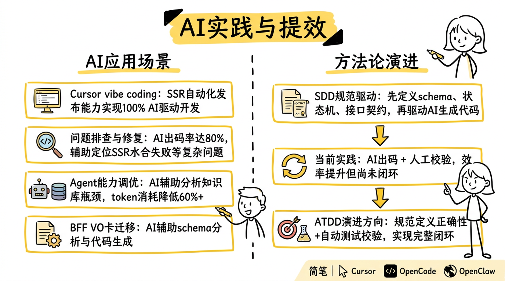
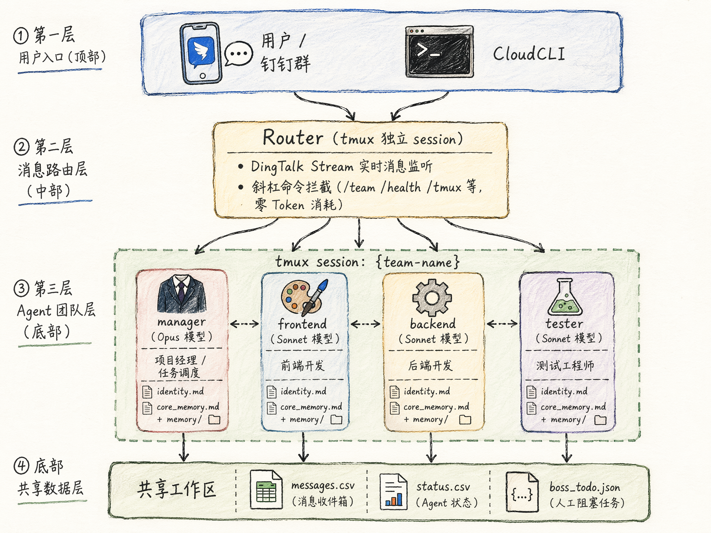
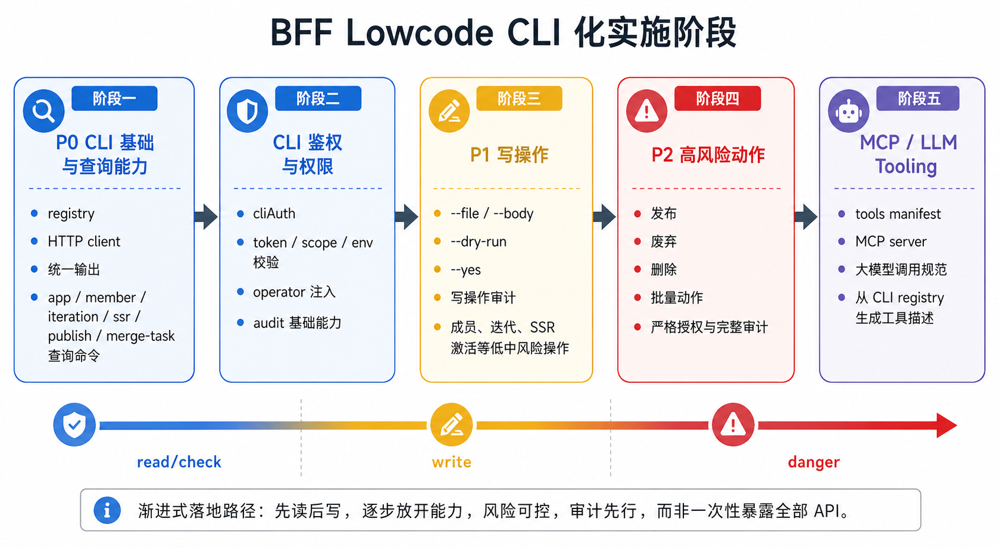

# image-gen — 风格迁移图像生成 Demo

> 该 Demo 演示如何通过 **风格参考图 + 文字意图** 生成与参考风格高度一致的图片。
> 工作流：`vision/describe`（风格对齐提示词）→ `image/generate`（文生图）

## TODO: 应用利用 qwen3.6plus 的 图片识别能力

---

## 图片说明

### 1. `sketch-knowledge-card.png` — 手绘知识卡片风（Sketch Knowledge Card）



**风格类型**：手绘卡通 + 思维导图 + 知识笔记风

**内容**：AI 实践与提效主题的双栏知识笔记，左侧展示 AI 应用场景（Cursor vibe coding、问题排查、Agent 调优），右侧展示方法论演进（SDD → ATDD），配有简笔人物、电脑、机器人等手绘插画。

**视觉特征**：

- 主色：黄色为主，黑字白底，色彩明快
- 线条：手绘简笔线条，边缘略显不规则，自然随性
- 图标：扁平化手绘图标（放大镜、烧杯、靶心、机器人等）
- 布局：左右分栏，层次清晰

**适用场景**：技术分享 PPT、内部培训材料、AI 工程化实践笔记、博客配图

---

### 2. `sketch-architecture.png` — 手绘系统架构图风（Sketch Architecture）



**风格类型**：手绘草图 + 插画 + 技术架构图混合风

**内容**：分层的 AI Agent 团队协作系统架构图，包含四层结构：用户入口层（钉钉群/CloudCLI）、消息路由层（Router/tmux）、Agent 团队层（manager/frontend/backend/tester 四个角色）、共享数据层（CSV/JSON 共享内存）。

**视觉特征**：

- 背景：米白色，搭配浅蓝、浅绿、浅黄、浅紫低饱和度色块
- 线条：铅笔/马克笔风格的手绘线条，略带不规则感
- 图标：卡通化手绘图标（西装人物、调色板、齿轮、烧杯等）
- 布局：纵向分层，双向箭头标注数据流

**适用场景**：技术方案讲解、系统设计文档可视化、开源项目 README、架构评审材料、技术博客配图

---

### 3. `tech-roadmap.png` — 科技路线图风（Tech Infographic Roadmap）



**风格类型**：现代科技类信息图表（Tech Infographic）+ 卡片式流程图

**内容**：BFF Lowcode CLI 化实施的五阶段路线图，从 P0 查询能力 → 鉴权权限 → P1 写操作 → P2 高风险动作 → MCP/LLM Tooling，底部配有从 read 到 danger 的渐变进度条。

**视觉特征**：

- 色彩渐变：蓝 → 黄 → 红 → 紫，象征风险等级递升
- 卡片式布局：每个阶段独立成块，边框颜色与标题统一
- 图标：扁平矢量图标（🔍 搜索、🛡 安全、✏ 编辑、⚠ 警告、🤖 AI）
- 整体简洁专业，信息密度适中

**适用场景**：技术路线图、架构设计评审、CLI/API 分阶段上线策略、安全合规汇报、产品白皮书

---

## 使用方法

### 方式一：直接运行 Demo 工作流

```bash
# 进入项目根目录
cd /path/to/bailian-cli

# 运行图像生成工作流（使用 inputs.json 中的默认输入）
pnpm -F bailian-cli dev pipeline run scene/image-gen/image-gen-workflow.json \
  --input-file scene/image-gen/inputs.json --verbose
```

### 方式二：自定义风格参考图和提示词

```bash
# 替换成你自己的风格参考图和创作意图
pnpm -F bailian-cli dev pipeline run scene/image-gen/image-gen-workflow.json \
  --input '{"prompt": "你的创作意图文字", "styleImage": "./your-style-ref.png"}'
```

### 方式三：用不同风格图片测试

三张参考图分别代表不同风格，可用于测试风格迁移效果：

| 风格参考图                  | 风格类型     | 适合生成               |
| --------------------------- | ------------ | ---------------------- |
| `sketch-knowledge-card.png` | 手绘知识卡片 | 技术笔记、知识梳理图   |
| `sketch-architecture.png`   | 手绘系统架构 | 架构图、系统设计图     |
| `tech-roadmap.png`          | 科技路线图   | 产品路线图、阶段规划图 |

```bash
# 用手绘架构图风格生成新内容
pnpm -F bailian-cli dev pipeline run scene/image-gen/image-gen-workflow.json \
  --input '{"prompt": "画一个微服务架构图", "styleImage": "./sketch-architecture.png"}'

# 用科技路线图风格生成新内容
pnpm -F bailian-cli dev pipeline run scene/image-gen/image-gen-workflow.json \
  --input '{"prompt": "产品功能规划的三个阶段", "styleImage": "./tech-roadmap.png"}'
```

### 工作流说明

`image-gen-workflow.json` 内部分两步执行：

1. **`prepare-style-aligned-prompt`**（`vision/describe`）：将参考图和用户意图合并，由视觉模型生成可直接用于文生图的风格对齐提示词
2. **`generate-image`**（`image/generate`）：将优化后的提示词送入图片生成模型，输出至 `./outputs/`

> **核心思路**：不需要用户自己描述视觉风格——只需提供一张参考图，系统自动提取风格并迁移到新内容上。
