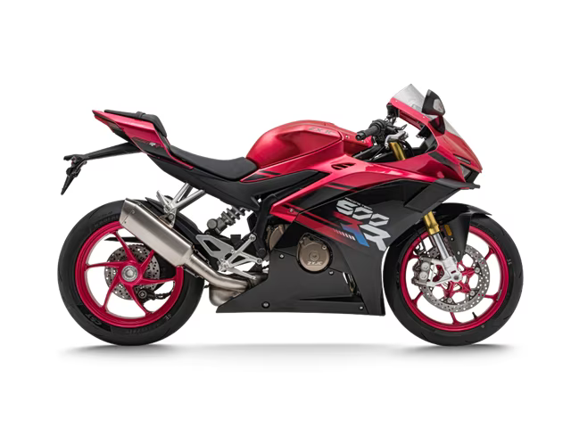

# Lego Build Sequence Pipeline

Generate a starting build image from a Lego motorcycle reference, then animate it into a build-sequence video.

## Input



## Steps

1. `generate-start-frame` (`image/edit`) creates a clean starting frame with partially assembled Lego parts.
2. `generate-build-video` (`video/generate`) animates the build process and downloads the final video.

## Run

```sh
pnpm -F bailian-cli dev pipeline validate scene/image2video/lego/lego-build-sequence.json
pnpm -F bailian-cli dev pipeline run scene/image2video/lego/lego-build-sequence.json
```

Use `--dry-run --output json` to inspect the plan without invoking image or video generation.
