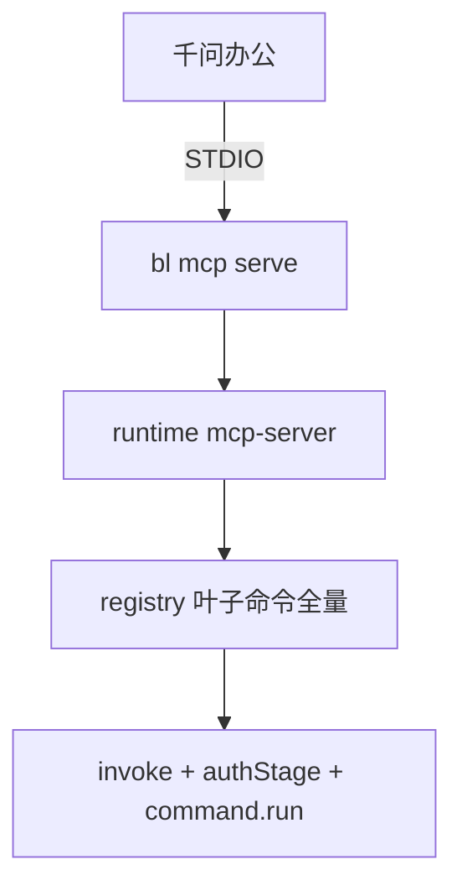

# 千问办公连接器集成 bailian-cli — 技术方案

## 1. 背景与目标

### 1.1 背景

千问办公（QwenWork）通过「连接器」把对话助手接到外部系统。bailian-cli（`bl`）是阿里云百炼 / Model Studio 的命令行产品。

### 1.2 目标

在千问办公中以自定义 MCP 连接器调用百炼 CLI 能力（生图、知识库、应用调用等），无需离开对话去开终端。

---

## 2. 千问办公侧

依据：[连接器｜千问办公帮助中心](https://qwenwork.cn/docs/features/connectors)。

入口：左侧「**扩展**」→「**连接器**」→「+ 添加」。本方案只用 **自定义 MCP · STDIO**。

注意：

- 连接器默认关闭，需用户开启。
- 开启/关闭后需**新建对话**才生效。
- STDIO 依赖本机可执行的 `bl`（或开发态等价启动命令）。

推荐配置（优先用本机登录态，JSON 里不写 Key）：

```json
{
  "mcpServers": {
    "bailian-cli": {
      "command": "bl",
      "args": ["mcp", "serve"]
    }
  }
}
```

可选：在连接器里用 `env` 注入模型 API Key（会覆盖本机 config 里的 key，见 §5.5）：

```json
{
  "mcpServers": {
    "bailian-cli": {
      "command": "bl",
      "args": ["mcp", "serve"],
      "env": {
        "DASHSCOPE_API_KEY": "sk-xxx"
      }
    }
  }
}
```

说明：`env` 注入的是**进程环境变量**名 `DASHSCOPE_API_KEY`，不是 `~/.bailian/config.json` 里的字段名 `api_key`。二者不要混用拼写。开发态可用仓库内 `tsx` 启动（见 §6）。

---

## 3. 现状与决策

### 3.1 bailian-cli 与 MCP

| 能力                            | 状态     | 说明                                            |
| ------------------------------- | -------- | ----------------------------------------------- |
| 调用百炼 MCP 广场               | 已有     | `bl mcp list` / `tools` / `call`（commands 库） |
| WebSearch 等                    | 已有     | `bl search web` 等                              |
| **把自己暴露为本机 MCP Server** | **已有** | `bl mcp serve`（runtime 内建）                  |

命名区分：

- `mcp list|tools|call`：CLI 当 **MCP Client**，调广场上的远端 server。
- `mcp serve`：CLI 当 **MCP Server**，给千问办公等客户端用。

---

## 4. 架构

```text
千问办公 (MCP Client)
        │  STDIO (stdin/stdout JSON-RPC)
        ▼
   bl mcp serve                 ← createCli 拦截，非 defineCommand
        │
        ▼
packages/runtime/mcp-server     ← McpServer + tool 注册 + invoke
        │
        ▼
registry.getLeafEntries()       ← 产品全部叶子命令
        │
        ▼
command.run(ctx)                ← 复用 authStage + 现有业务实现
        │
        ▼
bailian-cli-core                ← 本机鉴权 / HTTP / 配置
```



---

## 5. 实现说明（与代码对齐）

### 5.1 入口：`createCli` 拦截

文件：`packages/runtime/src/create-cli.ts`

- `--version` 在 dispatch 入口统一处理。
- 路径为 `mcp serve` 时：`--help` → `printMcpServeHelp`；否则 → `serveMcpStdio`。
- **不**走 `resolve` / middleware / `defineCommand.run`。
- `bl mcp --help` 会附加一行提示：runtime built-in `mcp serve`。

原因：MCP 需要 `registry.getLeafEntries()` 做全量挂载；commands 库单个 `run(ctx)` 拿不到完整命令表。

### 5.2 MCP host

目录：`packages/runtime/src/mcp-server/`

| 文件                | 职责                                                             |
| ------------------- | ---------------------------------------------------------------- |
| `serve.ts`          | `McpServer` + `StdioServerTransport`；`registerTool` 全量注册    |
| `schema.ts`         | path → tool 名；flags → Zod `inputSchema` / JSON Schema 辅助     |
| `invoke.ts`         | 构造 ctx → `authStage` + `run`；强制 `output=json`、`quiet=true` |
| `output-capture.ts` | ALS 捕获 `emitResult` / `emitBare`，避免污染 MCP stdout          |
| `help.ts`           | `bl mcp serve --help` 文案                                       |

依赖：`@modelcontextprotocol/server`、`zod`（挂在 `bailian-cli-runtime`）。

### 5.3 命令 → Tool

- 来源：`registry.getLeafEntries()`（来自 `packages/cli/src/commands.ts` 等产品 map + Command Pack）。
- 命名：`bailian_` + 路径空格改下划线，如 `text chat` → `bailian_text_chat`。
- `inputSchema`：由命令自有 `flags` 转 Zod object（无全局 / 凭证域 flag；凭证走本机 env / `~/.bailian`）。
- 同时传入 `commandPacks`，以便 `plugin *` 等工具可执行。

### 5.4 分层

| 层                  | 职责                                                    |
| ------------------- | ------------------------------------------------------- |
| `packages/runtime`  | `createCli` 拦截 + MCP host + stdout 隔离               |
| `packages/cli`      | 产品命令 map、identity；**不**单独注册 `mcp serve` leaf |
| `packages/commands` | 业务命令实现；**无** `mcp/serve.ts`                     |
| `packages/core`     | 不硬编码千问办公                                        |

### 5.5 鉴权与输出

复用现有 `authStage` / resolver；MCP **不**把 `--api-key` 等凭证域 flag 暴露进 tool `inputSchema`（避免 Key 进对话）。

#### 模型 API Key（`auth: "apiKey"` 的工具）

解析优先级（`resolveApiKey`）：

1. CLI flag `--api-key`（`mcp serve` 正常挂载调用时一般不会用到）
2. 环境变量 `**DASHSCOPE_API_KEY**`（连接器 JSON 的 `env` 可注入）
3. 本机配置文件 `**~/.bailian/config.json**` 字段 `**api_key**`（`bl auth login` 写入）

因此：连接器若设置了 `DASHSCOPE_API_KEY`，会优先于 config 里的 `api_key`；未设置时才读 `api_key`。

命名对照（不要混用）：

| 来源                     | 名称                | 说明                   |
| ------------------------ | ------------------- | ---------------------- |
| 连接器 / shell env       | `DASHSCOPE_API_KEY` | 环境变量               |
| `~/.bailian/config.json` | `api_key`           | 文件字段（snake_case） |
| tool 入参                | （不暴露）          | 不在 MCP inputSchema   |

`bl auth login`（模型 Key 流程）写入的是 config 的 `api_key`，不是环境变量。

#### Console / OpenAPI

- Console（`auth: "console"`）：读 config 的 `access_token` 等；需事先 `bl auth login --console`。
- OpenAPI（`auth: "openapi"`）：flag → `ALIBABA_CLOUD_ACCESS_KEY_*` env → config 的 `access_key_id` / `access_key_secret` 等。

#### 约束与输出通道

- 交互式浏览器 `auth login` 不在 MCP `tools/call` 内完成；引导终端先 login；可用 `bailian_auth_status` 查看状态。
- 禁止把 raw API Key / Console Token 写入 tool 响应或 verbose 日志。
- stdout：**仅** MCP JSON-RPC；业务结果经 capture 后放进 `content[].text`。
- stderr：就绪日志、进度等（如 `bl mcp serve: STDIO MCP ready (N tools)`）。

### 5.6 与 Skill

| 载体                 | 作用                        |
| -------------------- | --------------------------- |
| 连接器（本方案 MCP） | 可调用的原子工具            |
| Skill                | 多步工作流、选型与 hand-off |

二者互补；连接器主路径是 MCP。

### 5.7 尚未做（后续）

- 集成市场一键安装（底座仍是 STDIO）。

---

## 6. 用户接入

### 6.1 前置

1. 安装带 `mcp serve` 的 bailian-cli（发版后的全局 `bl`，或本仓库开发态）。
2. 鉴权二选一（或同时存在时以 env 优先，见 §5.5）：

- 推荐：`bl auth login` → 写入 `~/.bailian/config.json` 的 `api_key`（Console 场景再加 `--console`）。
- 或：连接器 JSON `env.DASHSCOPE_API_KEY=sk-xxx`。

3. 自检：`bl auth status`；可选 `bl mcp serve --help`。

### 6.2 开发态启动

千问办公 JSON 示例（开发态）：

```json
{
  "mcpServers": {
    "bailian-cli": {
      "command": "pnpm",
      "args": [
        "-C",
        "/path/to/bailian-cli",
        "-F",
        "bailian-cli",
        "exec",
        "tsx",
        "src/main.ts",
        "mcp",
        "serve"
      ]
    }
  }
}
```

### 6.3 在千问办公中添加

1. 「扩展」→「连接器」→「+ 添加」
2. 粘贴 JSON 或手动 STDIO：`bl` + `mcp serve`
3. 启用连接器，确认工具列表（数量应接近产品叶子命令数）
4. **新建对话**验证（如「查看百炼鉴权状态」「用百炼生成一张图」）

### 6.4 验收（P0）

- [x] `bl mcp serve` 可启动；stderr 打印 tool 数量
- [x] `initialize` / `tools/list` / `tools/call`（如 `bailian_auth_status`）STDIO 联调通过
- [x] 全量叶子命令挂载（无白名单）
- [x] `emitResult` 不污染 MCP stdout
- [ ] 千问办公实机：生图 / 知识库 / 应用调用等成功路径
- [ ] 未登录时错误可读、不泄漏密钥（实机再确认）

---

## 7. 风险

| 风险                 | 对策                                                    |
| -------------------- | ------------------------------------------------------- |
| 工具数量多、模型选错 | 接受全量；靠命名 + description / schema；后续再评估分组 |
| 危险写操作误调用     | 与 CLI 一致暴露；依赖连接器默认关闭 + 用户授权          |
| stdout 污染 MCP      | ALS 捕获业务输出                                        |
| 本机无 `bl` / 旧版本 | 发版说明写清；开发态用仓库 `tsx` 路径                   |
| 与 `mcp list` 混淆   | help / 文档区分 Client vs Server                        |
| 长任务超时           | 后续强化 task_id + 轮询（P1）                           |

---

## 8. 决策摘要

1. **形态**：本地 STDIO，`bl mcp serve`。
2. **工具面**：全量叶子命令，无白名单。
3. **落点**：runtime MCP host + `createCli` 早拦截；不进 commands 库。
4. **SDK**：`@modelcontextprotocol/server`（`McpServer`）。
5. **成功标准**：登录本机 `bl` 后，千问办公 STDIO 连接器可稳定调用与终端一致的能力。

---

## 9. 参考

- 千问办公连接器：[https://qwenwork.cn/docs/features/connectors](https://qwenwork.cn/docs/features/connectors)
- 仓库分层：`AGENTS.md`
- 产品命令 map：`packages/cli/src/commands.ts`
- 入口调度：`packages/runtime/src/create-cli.ts`
- MCP host：`packages/runtime/src/mcp-server/`

---

## 10. 修订记录

| 日期       | 说明                                                                                         |
| ---------- | -------------------------------------------------------------------------------------------- |
| 2026-08-06 | 初稿：可行性与 STDIO 方案                                                                    |
| 2026-08-10 | 决策：全量挂载、仅 STDIO、不做白名单                                                         |
| 2026-08-10 | 按落地实现重写：`createCli` 拦截、`@modelcontextprotocol/server`、文件落点与接入步骤对齐代码 |
| 2026-08-10 | 补齐鉴权：`DASHSCOPE_API_KEY` 与 config `api_key` 优先级、连接器 env 示例与命名对照          |
